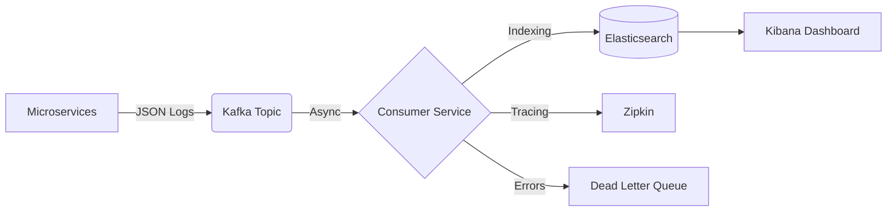
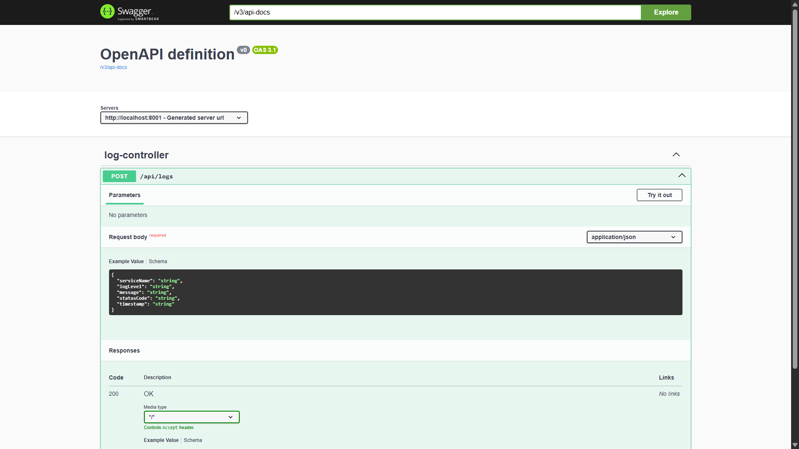

# DOCore Platform: Distributed Observability Core

### *A Real-Time, Event-Driven Log Aggregation System*

**Status:** ✅ Production Ready (v2.0 Released)

---

## 📖 The "Why" Behind This Project

During my journey of building complex microservices architectures (like my recent *Fit-Pilot* project), I encountered a significant operational bottleneck: **Observability**.

When a request failed in a distributed ecosystem of 6+ services, debugging was a nightmare. I found myself manually SSH-ing into different containers, grepping through isolated console logs, and trying to mentally stitch together timestamps to find the root cause. It was slow, inefficient, and unscalable.

**I realized that building microservices is only half the battle; managing them is the real challenge.**

I started this project, **DOCore**, to solve that specific pain point. My goal is to move from "hunting for logs" to "having logs come to me." This platform is my deep dive into building a production-grade, centralized logging infrastructure using Event-Driven Architecture.

---

## 🏗️ Architecture Overview

The DOCore Platform is designed to decouple log generation from log storage, ensuring high throughput and fault tolerance.

### The Pipeline (Data Flow)



1.  **Log Generation:** Microservices produce structured logs (JSON).
2.  **Transport Layer:** **Apache Kafka** acts as a high-speed buffer, receiving logs asynchronously.
3.  **Ingestion & Storage:** A consumer service reads from Kafka, handles errors (DLQ), and indexes data into **Elasticsearch**.
4.  **Visualization:** **Kibana** provides real-time dashboards for analysis, while **Zipkin** traces latency across services.

---

## 🛠️ Technology Stack

I selected this stack to mirror industry-standard observability platforms used by companies like Netflix and Uber.

* **Core Backend:** Java 21, Spring Boot 3.4.12
* **Message Broker:** Apache Kafka & Zookeeper
* **Observability:** Micrometer Tracing, Brave, Zipkin
* **Resilience:** Resilience4j (Circuit Breakers, Rate Limiters)
* **DevOps:** Docker, GitHub Actions (CI/CD), Docker Hub

---

## 💻 Getting Started

This project supports two modes: **Production Mode** (Full Docker) and **Developer Mode** (Hybrid).

### Prerequisites
* Docker Desktop
* *Optional (For Dev Mode only):* Java 21 JDK, Maven, IDE

### 🚀 Option A: Quick Start (Production Mode)
*Best for demos. Runs the fully packaged system (Apps + Infrastructure) using Docker Hub images.*

1.  **Launch the Platform:**
    ```bash
    docker compose up -d
    ```
    *This pulls the pre-built images (`dhinithya/docore-producer`, `dhinithya/docore-consumer`) from Docker Hub.*

2.  **Verify Health:**
    * **Producer API:** [http://localhost:8001/swagger-ui/index.html](http://localhost:8001/swagger-ui/index.html)
    * **Kibana Dashboard:** [http://localhost:5601](http://localhost:5601)
    * **Zipkin Tracing:** [http://localhost:9411](http://localhost:9411)

3.  **Test the Pipeline:**
    Use the Swagger UI above or send a curl command:
    ```bash
    curl -X POST http://localhost:8001/api/logs \
         -H "Content-Type: application/json" \
         -d '{
                 "serviceName": "payment-service",
                 "logLevel": "CRITICAL",
                 "message": "Production container test",
                 "statusCode": "500"}'
    ```

### 🛠️ Option B: Developer Setup (Hybrid Mode)
*Best for writing code. Runs infrastructure in Docker, but Java Apps in IntelliJ for debugging.*

1.  **Launch Infrastructure Only:**
    Use the dedicated dev compose file to start Kafka, Elastic, and Zipkin without the Java apps.
    ```bash
    docker compose -f docker-compose-dev.yml up -d
    ```

2.  **Run Applications Locally:**
    * Open the project in IntelliJ IDEA.
    * Run `LogProducerServiceApplication` (Starts on port 8001).
    * Run `LogConsumerServiceApplication` (Starts on port 6001).

3.  **Develop & Debug:**
    * Set breakpoints in IntelliJ.
    * The local apps automatically connect to the Dockerized infrastructure via mapped ports (`localhost:9092`, `localhost:9200`).

---

## 🚀 Current Progress: Phase 6

The pipeline is now fully operational end-to-end. Logs travel from API -> Kafka -> Database, carrying unique Trace IDs that persist across service boundaries. This enables engineers to correlate failures, latency spikes, and system behavior across asynchronous boundaries—something traditional logging setups fail to provide.

### ✅ Phase 1: Producer & Transport
- [x] **Infrastructure Orchestration:** Successfully containerized the entire Elastic stack (Elasticsearch, Kafka, Kibana, Zookeeper).
- [x] **Log Producer Service:** Built a Spring Boot microservice acting as a log emitter.
- [x] **Kafka Integration:** Implemented `KafkaTemplate` for asynchronous message dispatch.

### ✅ Phase 2: Consumer & Persistence
- [x] **Log Consumer Service:** Built a dedicated worker service using `@KafkaListener`.
- [x] **Elasticsearch Integration:** Implemented `ElasticsearchRepository` to index logs for high-speed searching.
- [x] **End-to-End Verification:** Validated that a `POST` request to the Producer results in a searchable document in the Elasticsearch database.

### ✅ Phase 3: Distributed Tracing & Stability
- [x] **Context Propagation:** Implemented *Micrometer Tracing* with *Brave* bridge.
- [x] **Trace ID Unification:** Solved "Split Trace ID" issue by enforcing W3C/B3 propagation standards.
- [x] **Consumer Reliability:** Fixed critical listener crashes by correctly mapping Kafka headers.

### ✅ Phase 4: Visualization & Deployment
- [x] **Distributed Tracing UI:** Integrated **Zipkin** to visualize request latency and service dependencies.
- [x] **Executive Dashboard:** Built a **Kibana** dashboard to monitor traffic volume and service health.
- [x] **API Documentation:** Integrated **Swagger UI** for interactive API testing and contract verification.
- [x] **Containerization:** Dockerized Java applications and published images to Docker Hub for 1-click deployment.

### ✅ Phase 5: Resilience & Error Handling
- [x] **Dead Letter Queue (DLQ):** "Poison Pill" messages are automatically routed to a separate error topic/index.
- [x] **Circuit Breaker:** The Consumer degrades gracefully (to console logging) if Elasticsearch goes down.
- [x] **Defensive Coding:** Strict null-safety checks to prevent consumer crashes.

### ✅ Phase 6: Security & Traffic Control
- [x] **API Security:** Secured the ingestion endpoint with `X-API-KEY`.
- [x] **Rate Limiting:** Implemented Token Bucket algorithm (Resilience4j) to prevent DDoS/spam.
- [x] **Swagger Auth:** Configured OpenAPI to handle secure requests.

### ✅ Phase 7: DevOps & Automation
- [x] **CI/CD Pipeline:** GitHub Actions automatically builds and pushes Docker images on every commit.
- [x] **Docker Hub Integration:** Images are published to `dhinithya/docore-producer` and `dhinithya/docore-consumer`.
- [x] **Multi-Module Build:** Automated Maven builds for the monorepo structure.

---

## 🧠 Engineering Challenges & Lessons Learned

Building a distributed system is rarely straightforward. Here are the significant technical hurdles I overcame:

### 1. The "Bleeding Edge" Version Conflict
* **The Issue:** I initially set up the project using **Spring Boot 4.0.0** (Experimental). This caused severe `NoClassDefFoundError` crashes because the Spring Data Elasticsearch ecosystem has not yet caught up to this beta version.
* **The Solution:** I refactored the project to use **Spring Boot 3.4.12 (Stable)**.
* **The Lesson:** In infrastructure engineering, stability > novelty. Always verify library compatibility matrices before choosing a framework version.

### 2. The "Language Barrier" (Serialization)
* **The Issue:** The Consumer Service crashed with `SerializationException: No type information in headers`. Kafka transmits raw bytes, and the Consumer received the JSON but didn't know which Java Class (`LogEvent`) to map it to.
* **The Solution:** I configured the Consumer's `application.yml` to enforce a default type mapping:
    ```yaml
    spring.json.value.default.type: "com.docore.consumer.entity.LogEvent"
    ```
* **The Lesson:** Decoupled services need strict contracts. When metadata headers are missing (e.g., from raw `curl` requests), explicit type definitions are required.

### 3. Elasticsearch Security Handshake (HTTP vs HTTPS)
* **The Issue:** The application failed to connect to the database with `[es/indices.exists] Expecting a response body`. Elasticsearch 8 defaults to "Secure Mode" (HTTPS), rejecting the application's standard HTTP connection.
* **The Solution:** I reconfigured the Docker environment to disable `xpack.security` for the development profile, allowing seamless communication without complex certificate management during the prototyping phase.

### 4. The "Split Trace ID" Mystery
* **The Issue:** Even though I added tracing dependencies, the Producer and Consumer were generating different Trace IDs for the same request. The context was being lost during the Kafka hop.
* **The Solution:** I discovered that Spring Boot 3 defaults to W3C standards, while Brave defaults to B3. I had to explicitly configure both services to speak the same "tracing language" in `application.yaml`:
    ```yaml
    management.tracing.propagation.type: "w3c,b3"
    ```
* **The Lesson:** "Magic" auto-configuration often fails in distributed systems. Explicitly defining protocols (propagation types) is crucial for service interoperability.

### 5. The "Dual-Role" Identity Crisis (Producer-in-Consumer)
* **The Issue:** When the Consumer tried to move a failed message to the Dead Letter Queue (DLQ), the application crashed with `SerializationException`. The Consumer Service was configured to *read* JSON, but it didn't know how to *write* (serialize) the Java Object back into JSON when acting as a Producer for the DLQ.
* **The Solution:** I explicitly configured the Consumer's Producer Factory in `application.yml` to use `JsonSerializer`, enabling the service to switch roles dynamically without configuration conflicts.
* **The Lesson:** In event-driven architectures, "Consumer" is often a misnomer. Resilience patterns like DLQs turn consumers into producers, requiring a complete serialization/deserialization setup.

### 6. The "Intelligent Listener" Trap (Poison Pills)
* **The Issue:** A "Poison Pill" (malformed JSON) entered the topic. The main consumer correctly rejected it, but when the DLQ Listener tried to pick it up, it *also* crashed. The DLQ Listener was trying to be "smart" by mapping the garbage data to a `LogEvent` object, causing an infinite failure loop.
* **The Solution:** I "dumbed down" the DLQ Listener by using the `properties` attribute in `@KafkaListener` to force `StringDeserializer`. This ensures the DLQ accepts *any* raw text—no matter how broken—without trying to parse it.
* **The Lesson:** Error handling pipelines must be more robust than the main pipeline. When cleaning up toxic data, treat payload as raw bytes/strings, not structured objects.

### 7. The "Black Hole" of Observability (Lost Context)
* **The Issue:** We successfully implemented the DLQ, but the error logs in Elasticsearch were "orphaned." The Distributed Trace ID (Zipkin) was lost during the move to the DLQ, making it impossible to correlate a database error log back to the original user request.
* **The Solution:** I modified the `DlqConsumerService` to manually extract the `traceId` header from the Kafka record and updated the `ErrorLog` entity to index this ID.
* **The Lesson:** Observability isn't automatic at the edges of a system. When moving data out of the "Happy Path" (e.g., to a DLQ), you must manually carry the context (Trace IDs) across the boundary.

---

## 📸 System Dashboards

**1. The Executive Dashboard (Kibana)**
A "Single Pane of Glass" monitoring system. The Donut Chart (right) uses **Log Enrichment** to visualize HTTP status codes, allowing engineers to instantly spot "Red" (500) error spikes.


**2. Distributed Tracing (Zipkin)**
Visualizes the lifecycle of a log request. The trace below captures the 5ms latency hop as the message travels from Producer → Kafka → Consumer.


**3. Interactive API Documentation (Swagger UI)**
Auto-generated API documentation complying with OpenAPI 3.0 standards. It provides a "Try it out" interface for developers to test the ingestion pipeline without writing manual `curl` commands, ensuring strict API contract adherence.



---


## 🔮 What's Next? (Phase 8)

1.  **Metrics:** Integrate **Prometheus & Grafana** for hardware/JVM monitoring.
2.  **Cloud Deployment:** Deploy the stack to AWS EC2.
3.  **Alerting:** Slack notifications for critical error spikes.
---

**Author:**
Dhinithya Verma

*Documenting my journey into Distributed Systems & Observability Engineering.*


