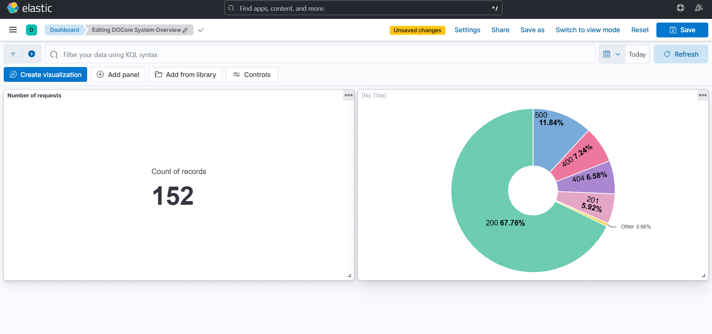
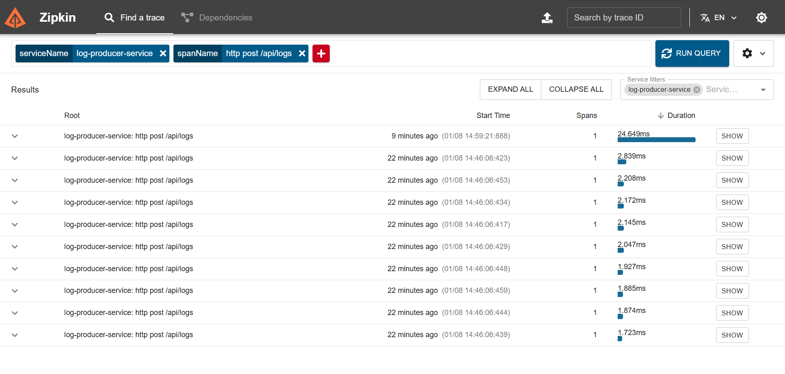

# DOCore Platform: Distributed Observability Core

### *A Real-Time, Event-Driven Log Aggregation System*

**Status:** 🚧 In Development (Phase 5: Resilience & Production Hardening)
## 📖 The "Why" Behind This Project

During my journey of building complex microservices architectures (like my recent *Fit-Pilot* project), I encountered a significant operational bottleneck: **Observability**.

When a request failed in a distributed ecosystem of 6+ services, debugging was a nightmare. I found myself manually SSH-ing into different containers, grepping through isolated console logs, and trying to mentally stitch together timestamps to find the root cause. It was slow, inefficient, and unscalable.

**I realized that building microservices is only half the battle; managing them is the real challenge.**

I started this project, **DOCore**, to solve that specific pain point. My goal is to move from "hunting for logs" to "having logs come to me." This platform is my deep dive into building a production-grade, centralized logging infrastructure using Event-Driven Architecture.

---

## 🏗️ Architecture Overview

The DOCore Platform is designed to decouple log generation from log storage, ensuring high throughput and fault tolerance.

### The Pipeline (Data Flow)
1.  **Log Generation:** Microservices produce structured logs (JSON).
2.  **Transport Layer:** **Apache Kafka** acts as a high-speed buffer, receiving logs asynchronously.
3.  **Ingestion & Storage:** A consumer service reads from Kafka and indexes data into **Elasticsearch**.
4.  **Visualization:** **Kibana** provides real-time dashboards for analysis, while **Zipkin** traces latency across services.
---

## 🛠️ Technology Stack

I selected this stack to mirror industry-standard observability platforms used by companies like Netflix and Uber.

* **Core Backend:** Java 21, Spring Boot 3.4.12
* **Message Broker:** Apache Kafka (Event Streaming) & Zookeeper
* **Observability:** Micrometer Tracing, Brave (context propagation)
* **Infrastructure:** Docker & Docker Compose
* **Data Format:** JSON (Serialized via Jackson)

---

## 🚀 Current Progress: Phase 4

The pipeline is now fully operational end-to-end. Logs travel from API -> Kafka -> Database, carrying unique Trace IDs that persist across service boundaries. 
This enables engineers to correlate failures, latency spikes, and system behavior across asynchronous boundaries—something traditional logging setups fail to provide.


### ✅ Phase 1: Producer & Transport
- [x] **Infrastructure Orchestration:** Successfully containerized the entire Elastic stack (Elasticsearch, Kafka, Kibana, Zookeeper).
- [x] **Log Producer Service:** Built a Spring Boot microservice acting as a log emitter.
- [x] **Kafka Integration:** Implemented `KafkaTemplate` for asynchronous message dispatch.

### ✅ Phase 2: Consumer & Persistence
- [x] **Log Consumer Service:** Built a dedicated worker service using `@KafkaListener`.
- [x] **Elasticsearch Integration:** Implemented `ElasticsearchRepository` to index logs for high-speed searching.
- [x] **End-to-End Verification:** Validated that a `POST` request to the Producer results in a searchable document in the Elasticsearch database.

### ✅ Phase 3: Distributed Tracing & Stability
- [x] **Context Propagation:** Implemented *Micrometer Tracing* with *Brave* bridge.
- [x] **Trace ID Unification:** Solved "Split Trace ID" issue by enforcing W3C/B3 propagation standards.
- [x] **Consumer Reliability:** Fixed critical listener crashes by correctly mapping Kafka headers.

### ✅ Phase 4: Visualization & Monitoring
- [x] **Distributed Tracing UI:** Integrated **Zipkin** to visualize request latency and service dependencies.
- [x] **Executive Dashboard:** Built a **Kibana** dashboard to monitor traffic volume and service health.
- [x] **Visual Status Tracking:** Implemented "Colorful Status Codes" (200s vs 500s) to visually identify error spikes on the dashboard.
---

## 🧠 Engineering Challenges & Lessons Learned

Building a distributed system is rarely straightforward. Here are the significant technical hurdles I overcame during Phase 2:

### 1. The "Bleeding Edge" Version Conflict
* **The Issue:** I initially set up the project using **Spring Boot 4.0.0** (Experimental). This caused severe `NoClassDefFoundError` crashes because the Spring Data Elasticsearch ecosystem has not yet caught up to this beta version.
* **The Solution:** I refactored the project to use **Spring Boot 3.4.12 (Stable)**.
* **The Lesson:** In infrastructure engineering, stability > novelty. Always verify library compatibility matrices before choosing a framework version.

### 2. The "Language Barrier" (Serialization)
* **The Issue:** The Consumer Service crashed with `SerializationException: No type information in headers`. Kafka transmits raw bytes, and the Consumer received the JSON but didn't know which Java Class (`LogEvent`) to map it to.
* **The Solution:** I configured the Consumer's `application.yml` to enforce a default type mapping:
    ```yaml
    spring.json.value.default.type: "com.docore.consumer.entity.LogEvent"
    ```
* **The Lesson:** Decoupled services need strict contracts. When metadata headers are missing (e.g., from raw `curl` requests), explicit type definitions are required.

### 3. Elasticsearch Security Handshake (HTTP vs HTTPS)
* **The Issue:** The application failed to connect to the database with `[es/indices.exists] Expecting a response body`. Elasticsearch 8 defaults to "Secure Mode" (HTTPS), rejecting the application's standard HTTP connection.
* **The Solution:** I reconfigured the Docker environment to disable `xpack.security` for the development profile, allowing seamless communication without complex certificate management during the prototyping phase.

### 4. The "Split Trace ID" Mystery
* **The Issue:** Even though I added tracing dependencies, the Producer and Consumer were generating different Trace IDs for the same request. The context was being lost during the Kafka hop.
* **The Solution:**I discovered that Spring Boot 3 defaults to W3C standards, while Brave defaults to B3. I had to explicitly configure both services to speak the same "tracing language" in `application.yaml`

```yaml
management.tracing.propagation.type: "w3c,b3"
```

* **The Lesson:** "Magic" auto-configuration often fails in distributed systems. Explicitly defining protocols (propagation types) is crucial for service interoperability.
---

## 💻 Getting Started (Local Setup)

This project uses a hybrid development setup: Infrastructure runs on **WSL/Ubuntu**, while code is developed in **IntelliJ (Windows)**.

### Prerequisites
* Docker Desktop
* Java 21 (JDK)
* Maven

### 1. Launch Infrastructure
The backend services are defined in `docker-compose.yml`.

```bash
# From the project root
docker compose up -d
```
Verifying : Run `docker ps` to ensure Kafka,Zookeeper, Elasticsearch and Kibana are running.

### 2. Run the Services
1. **Producer:** Run `LogProducerServiceApplication` (port 6000)
2. **Consumer:** Run `LogConsumerServiceApplicartion` (port random/internal 6001).

### 3. Test the Pipeline
Send the `POST` request to trigger a log event:

```bash
curl -X POST http://localhost:6000/api/logs \
     -H "Content-Type: application/json" \
     -d '{
             "serviceName": "payment-service",
             "logLevel": "CRITICAL",
             "message": "Gateway Timeout 504",
             "statusCode": "500"}'
```

### 4. Verify Trace Propagation
Check the Consumer logs. You should see the Trace ID (e.g., `6943cf3...`) in the brackets:

``` Plaintext
INFO [log-consumer-service,6943cf3...,...] : Received Log: Testing Trace ID Propagation
```

### 5. Verify Database
Check Elasticsearch to confirm the log was saved. Open browser: `http://localhost:9200/app-log/_search?pretty`

You should see: `{
  "_source" : {
    "message" : "Testing Trace ID Propagation",
    "timestamp" : "..."
  }
}`

### 📸 System Dashboards
**1. The Executive Dashboard (Kibana)**
A "Single Pane of Glass" monitoring system. The Donut Chart (right) uses **Log Enrichment** to visualize HTTP status codes, allowing engineers to instantly spot "Red" (500) error spikes.



**2. Distributed Tracing (Zipkin)**
Visualizes the lifecycle of a log request. The trace below captures the 5ms latency hop as the message travels from Producer → Kafka → Consumer.



---
## 🔮 What's Next? (Phase 5: Resilience)
With the visualization layer complete, the focus shifts to production-grade reliability and "Chaos Engineering."

1.  **Dead Letter Queue (DLQ):** Implement a safety mechanism to catch "poison pill" messages so one bad log doesn't crash the consumer.
2.  **Circuit Breakers (Resilience4j):** Prevent the Consumer from overwhelming Elasticsearch if the database goes down.
3.  **Full Containerization:** Dockerize the Producer and Consumer Java applications to enable a true "1-click deploy" (`docker compose up --build`).
---

Author:

Dhinithya Verma

Documenting my journey into Distributed Systems & Observability Engineering.
